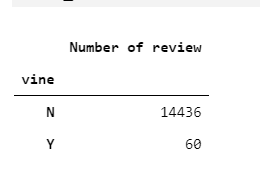

# Amazon_Vine_Analysis
# Overview
We will examine reviews of Musical instruments dataset from Amazon Vine program. 
[Amazon reviews us Musical Instruments](https://s3.amazonaws.com/amazon-reviews-pds/tsv/amazon_reviews_us_Musical_Instruments_v1_00.tsv.gz)
The dataset has the following schema: 
[Amazon review dataset schema](Resources/amazon-review-datasets-schema.png)
The Amazon Vine program is a service that allows manufacturers and publishers to receive reviews for their products.  Companies subscribe to this service by paying a small fee to Amazon and provide products to Amazon Vine members, who are then required to publish a review. 
We use PySpark to perform the ETL process to extract the dataset, transform the data, connect to an AWS RDS instance, and load the transformed data into pgAdmin. We then use Pandas to determine if there is any bias towards favorable reviews from Vine members in the dataset.

# Summary
For the analsyis we used the below variables from our Musical Instruments dataset 
 
We then peform the following transforms to the dataframe: 
1- Select only the records where the total votes was equal or greater than 20
2- From the selection in step 1 choose only the records where percentage of helpful votes is equal or greater than 50%.
3- Calculate the total # of reviews, the # of 5-star reviews and the % of 5-star reviews for each member type 

We notice that the number of non Vine votes is much larger than the member votes.  

But when we look at the percentage of five star reviews between the two categories they closely match. 

This leads us to the conclusion that there is not positivity bias in the Vine program.